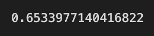

# Credit_Risk_Analysis

## Overview

The purpose of this analysis was to create a supervised machine learning model that can accurately measure credit risk and loan default. We test numerous different models to see which one most accurately predicts the outcomes based on test data.

## Results

### Over/Under Sampling Models

- Naive Random Oversampling

Balanced Accuracy Score (BAS) 

High Risk Precision: 0.01
Low Risk Precision: 1.00
High Risk Recall: 0.63
Low Risk Recall: 0.67

- SMOTE Oversampling
BAS 
High Risk Precision: 0.01
Low Risk Precision: 1.00
High Risk Recall: 0.64
Low Risk Recall: 0.66

- ClusterCentroids Undersampling
BAS 
High Risk Precision: 0.01
Low Risk Precision: 1.00
High Risk Recall: 0.63
Low Risk Recall: 0.39

- SMOTEENN Combination (Over and Under) Sampling
BAS 
High Risk Precision: 0.01
Low Risk Precision: 1.00
High Risk Recall: 0.69
Low Risk Recall: 0.55

### Ensamble Models

- Balanced Random Forest Classifier
BAS 
High Risk Percision: 0.04
Low Risk Percision: 1.00
High Risk Recall: 0.67
Low Risk Recall: 0.91

- Easy Ensemble AdaBoost Classifier
BAS 
High Risk Precision: 0.07
Low Risk Precision: 1.00
High Risk Recall: 0.91
Low Risk Recall: 0.94

## Summary

The strongest model in our test was the AdaBoost Classifier. While the precision of the High Risk predicitions is still low, it is skewed by the extremely small number of High Risk loans. It still flags quite a few loans that may not need to be flagged (nearly 1000), but not enough that can't be reviewed by an employee to make a final judgement. And the AdaBoost Classifier only misses 7.5% of loan predictions in this dataset.

(I'm also sorry that I did not include screenshots of my other reports. They are not formatted properlly in my VS Code for some reason.)
